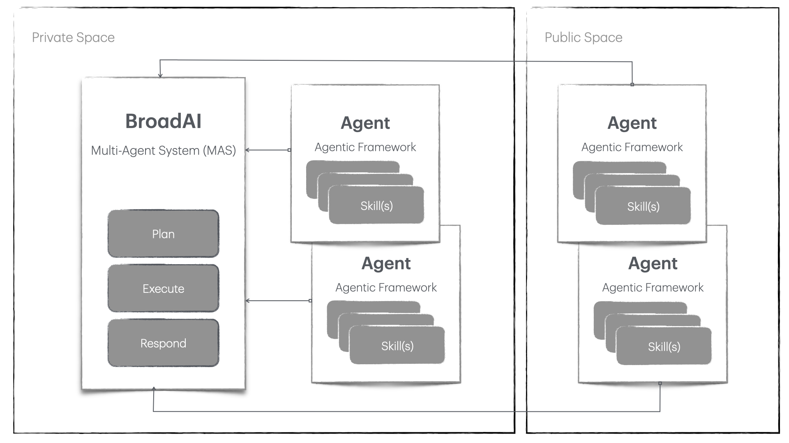

## Concept

Us humans naturally apply a cognitive approach to accomplish our tasks, and *albeit*, achieve bigger goals. Tasks, such as - having a cup of home brewed coffee, making indian or international cuisine for family dinner, responding to  emails, etc. are some of the tasks that we carry out very naturally, but we don't think about the skills required behind conduting these actions! 

So, in a way, we are multi-faceted species that are constantly deploying our varied skillsets (even learning a few on the way) to meet a said goal and objective.

Ever since inception of Artificial Intelligence (AI), we have been putting AI systems through the same tests. We expect the AI systems to think, act, and behave like us, *humans* (a.k.a. [Turing Test](./assets/docs/turing1948.pdf)).

**BroadAI** is based on the similar idea and is built as a framework to support the latest iteration around building smart and intelligent AI systems. It takes a Multi-Agent Systems (MAS) approach where an AI system can demonstrate complex skills via working in an environment comprised of multiple expert agents with specialized skills. With centrally managed delegation by BroadAI, appropriate agents can collectively achieve any given goal.

<pre style="margin-top:-10px; background:none; border:0; text-align: center;">BroadAI framework</pre>

The conceptual diagram above shows how we provide frameworks to help you build a multi-agent AI system. 

A prominent point-of-view here is that BroadAI Agents can be built and used within private confines of trust and control, or can be published to our agent store for broader consumption. Either ways, our agentic framework follows plug-and-play principle.

---

  

  <h2>BroadAI Mission:</h2>
  

  To enable seamless integration of diverse and versatile Agents within the BroadAI systems, empowering the development of ethical, effective, and impactful AI solutions.
  

  

  

    <form>
      <h3>
        Learn, explore, and unlock endless possibilites with BroadAI.
      </h3>
      <input type="text" id="name" name="name" placeholder="Your name" required style="width:calc(100% - 20px); padding:10px; margin:0.5em 0; border:1px solid #ddd; border-radius:4px; box-sizing:border-box;">
      <input type="email" id="email" name="email" placeholder="Your email" required style="width:calc(100% - 20px); padding:10px; margin:0.5em 0; border:1px solid #ddd; border-radius:4px; box-sizing:border-box;">
      <input type="button" id="btnsave" value="Stay Connected" onClick="subscribe()" style="font-family: 'Architects Daughter', 'Helvetica Neue', Helvetica, Arial, serif; font-size: 18px; text-align: center; padding: 10px; margin: 0 10px 10px 0; color: #fff; background-color: #2e7bcf; border: none; border-radius: 5px; -moz-border-radius: 5px; -webkit-border-radius: 5px;">
    </form>
  

---

## Who uses BroadAI?

There are following two persona that use the BroadAI Framework:

| Application Developers | Agent Developers |
|---|---|
| Develop applications enhanced by AI capabilities. | Develop and publish BroadAI agents. |
| Use [**BroadAI MAS framework**](/docu-mas.html). | Use [**BroadAI Agentic framework**](/docu-agentic.html). |
| Highly valuable to speed-up GenAI application development as developers can benefit from minimal coding requirements to build a complex agentic AI backed application. | Highly valuable for businesses to make ready to plug-and-play agents for application developers using BroadAI framework. This will eventually drive higher user adoption. |
| *Examples*:* | *Examples*:* |
| 1. An event concierge application helping it's users to plan and book their itinerary across various vendors, such as Hotels, Airlines, Cabs, etc. | Capability-specific agents, such as Hotel booking agent, Airlines booking agent, Cab service booking agent etc., can be developed using BroadAI Agentic framework (and published on Agent Store), which can be quickly integrated by application developers in their application using BroadAI MAS framework. |
| 2. A news aggregator providing personalization so it's readers can be served news from it's preferred sources and from preferred topics. They use NLP capabilities instead of traditional filtering techniques. | Category-specific agents can be developed, such as, Business news agent, Tech news agent, etc., where each agent can provide RAG-based AI capabiltiies. Using such agents will drastically simplify the architecture for application developer and drive a modular approach so that each agent can be individually enhanced over time. |

---
